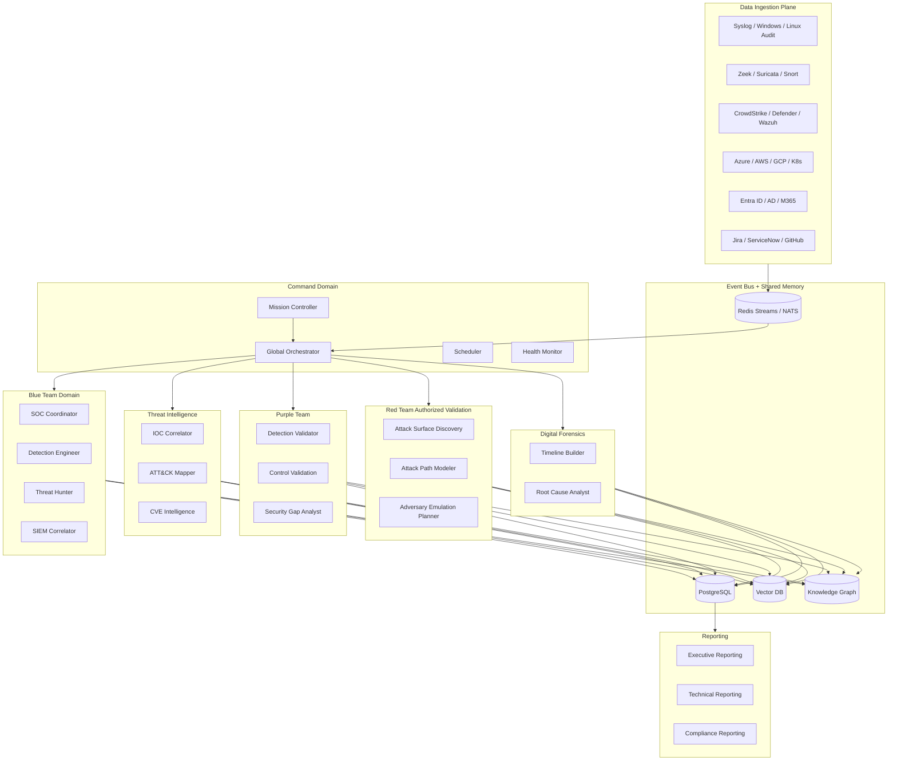
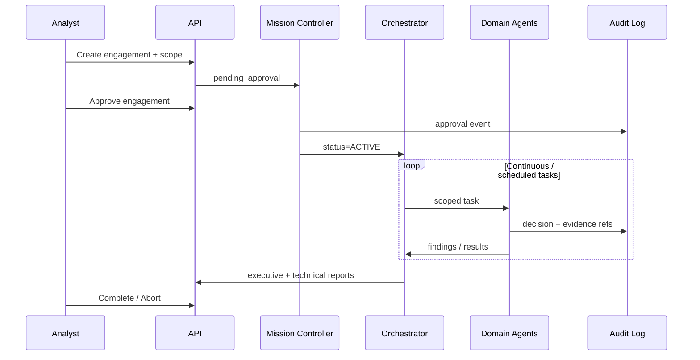

# AEGIS Swarm — Enterprise Architecture Overview

## Mission

AEGIS (Autonomous Enterprise Guard & Intelligence System) is a **cloud-native multi-agent AI platform** that operates as an autonomous Security Operations capability for:

- Continuous asset discovery and telemetry correlation  
- Threat assessment and ATT&CK mapping  
- Detection engineering and coverage analysis  
- Authorized purple-team control validation  
- DFIR support and incident reconstruction  
- Executive and technical risk reporting  

**Non-negotiables:** defined engagement scope, immutable audit logs, human approval gates for validation modes, remediation-first outputs.

---

## Logical architecture



---

## Control flow (engagement lifecycle)



---

## Deployment topology

| Layer | Technology |
|-------|------------|
| API / control plane | FastAPI, Uvicorn |
| Messaging | Redis Streams (dev), NATS/Kafka (prod) |
| System of record | PostgreSQL 16 |
| Hot cache / locks | Redis |
| Embeddings / similarity | Vector DB (pgvector or dedicated) |
| Relationship analysis | Knowledge graph (NetworkX in-process → Neo4j prod) |
| Runtime | Kubernetes + Docker |
| Mesh / mTLS | Optional service mesh (Linkerd/Istio) |
| Identity | OIDC + RBAC (Least privilege per agent domain) |
| Observability | Prometheus metrics, structured audit logs |

---

## Zero Trust principles

1. Every task carries `engagement_id` and is refused if engagement is not `ACTIVE`.  
2. Agents validate targets against engagement scope before work.  
3. Privileged validation actions require explicit `allowed_validation_actions`.  
4. All agent decisions write to `audit_log`.  
5. Human kill-switch via Mission Controller `abort`.  
6. Network policies isolate agent domains; API is the only north-south entry.

---

## Workflow pipeline

```
Asset Discovery → Telemetry Collection → Normalization
  → Threat Intel Correlation → Detection Analytics → Behavior Analytics
  → Threat Assessment → Risk Prioritization → Control Validation
  → Executive & Technical Reporting
```
